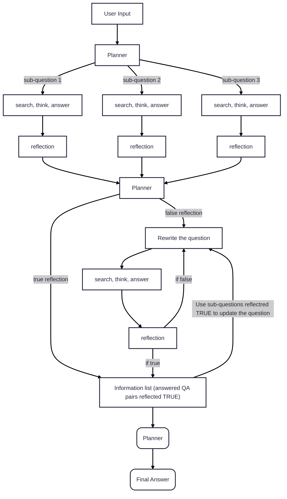
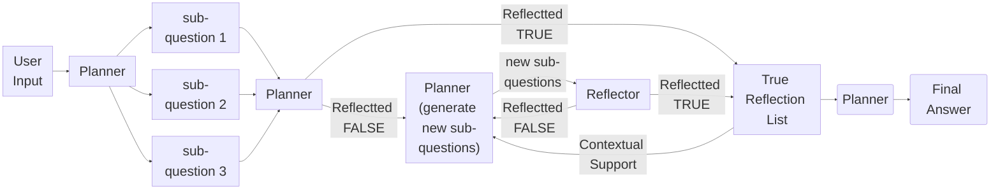

```mermaid
---
config:
  theme: redux
  layout: dagre
---
flowchart TB
    A["User Input"] --> B["Planner"]
    B -- "sub-question 1" --> C["search, think, answer"]
    B -- "sub-question 2" --> D["search, think, answer"]
    B -- "sub-question 3" --> E["search, think, answer"]
    C --> F["reflection"]
    D --> G["reflection"]
    E --> H["reflection"]
    F --> I["Planner"]
    G --> I
    H --> I
    I -- false reflection --> J["Rewrite the question"]
    I -- true reflection --> K["Information list (answered QA pairs reflected TRUE)"]
    J --> L["search, think, answer"]
    L --> M["reflection"]
    M -- if true --> K
    K -- "Use sub-questions reflectred TRUE to update the question" --> J
    M -- if false--> J
    K --> O("Planner")
    O --> P("Final Answer")
```

```mermaid
---
config:
  themeVariables:
    fontSize: '40px'
---
flowchart LR
    A["User</br>Input"] --> B["Planner"]
    B --> C["sub-question 1"]
    B --> D["sub-question 2"]
    B --> E["sub-question 3"]
    C --> G["Planner"]
    D --> G
    E --> G
    G -- Reflectted FALSE --> H["Planner (generate new sub-questions)"]
    G -- Reflectted TRUE --> I["True Reflection List"]
    H -- new sub-questions --> J["Reflector"]
    J -- Reflectted TRUE --> I
    I -- "Contextual Support" --> H
    J -- Reflectted FALSE --> H
    I --> K("Planner")
    K --> L("Final Answer")
```