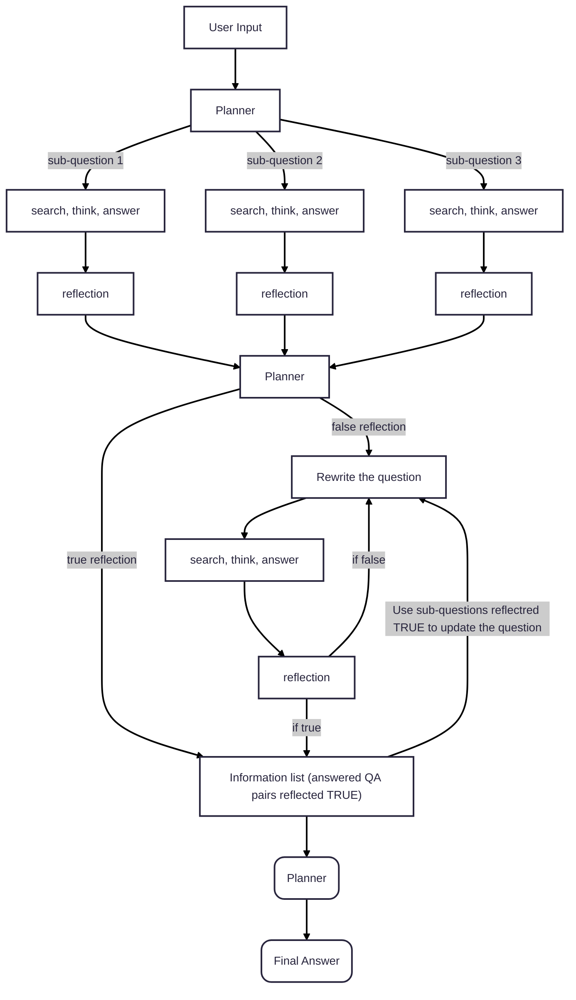
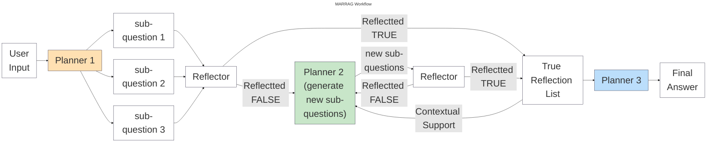
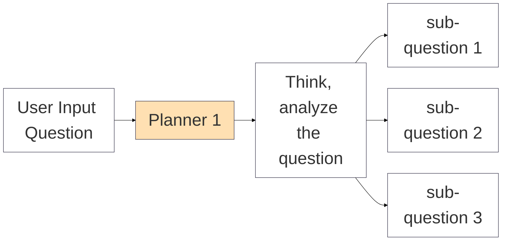
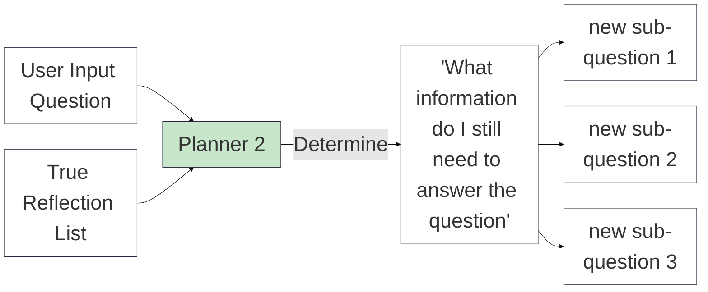
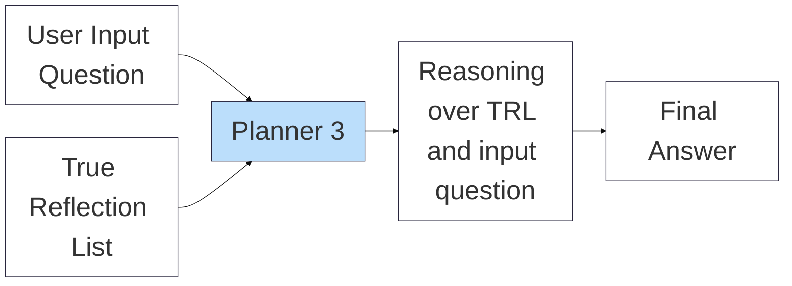
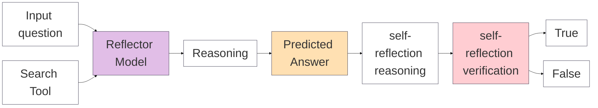

# Mermaid Workflow Diagram old

# Mermaid Workflow Diagram

# Planner1 (sub-question generation) diagram

# Planner2 (sub-question re-generation) diagram

# Planner3 (Final answer analyser) diagram

# Reflector Generation workflow diagram

