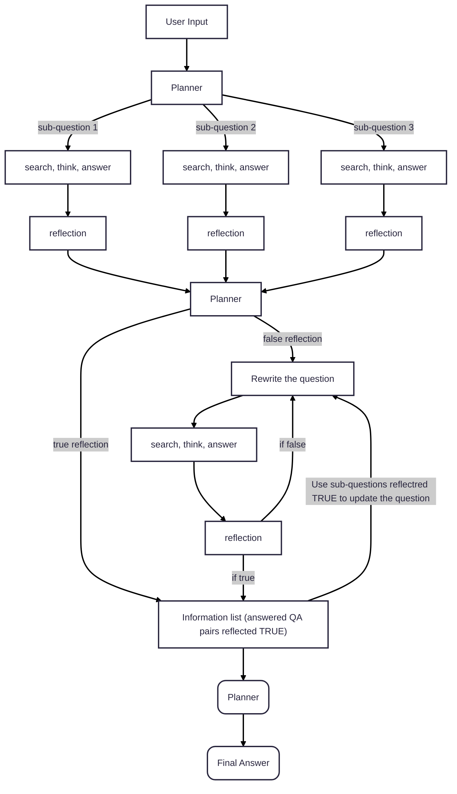
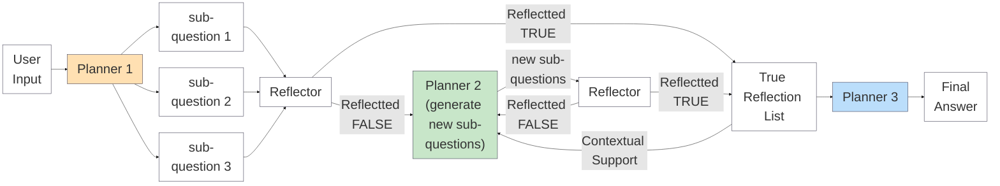

# Mermaid Workflow Diagram old


# Mermaid Workflow Diagram


# Planner1 (sub-question generation) diagram
```mermaid
```

# Planner2 (sub-question re-generation) diagram
```mermaid
```


# Planner3 (Final answer analyser) diagram
```mermaid
```


# Reflector Generation workflow diagram
```mermaid
```
